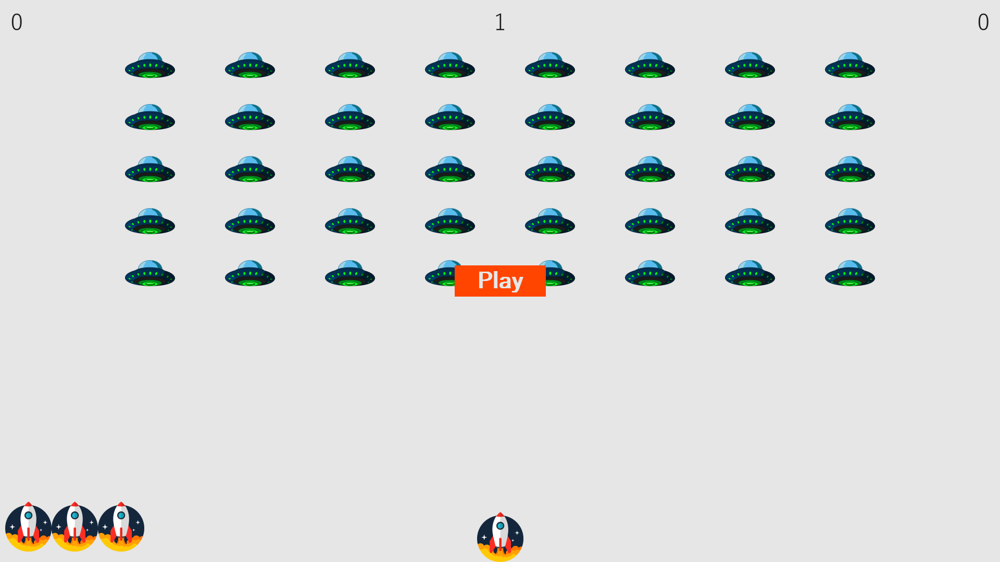

# Alien Invasion

---
Alien Invasion - это классическая аркадная игра, в которой игрок играет за космический корабль и защищаться от вторжения пришельцев.

Игра происходит на экране, где в верхней части отображаются ряды инопланетных кораблей, которые постепенно опускаются на игрока. Игрок должен уничтожать эти корабли, стреляя по ним лазерными лучами. По мере того как игрок продвигается в игре, пришельцы начинают двигаться быстрее.

Игра Alien Invasion не имеет конца, и ее цель — набрать наибольшее количество очков, уничтожая как можно больше кораблей. После каждой волны пришельцев игрок будет получать все больше очков за уничтожение пришельцев.

---




## Установка
1. Клонировать репозиторий
```
git clone https://github.com/Sogato/AlienInvasion.git
```
2. Установить зависимости
```
pip install -r requirements.txt
```

## Использование
Запустите приложение:
```
cd src

python alien_invasion.py
``` 
